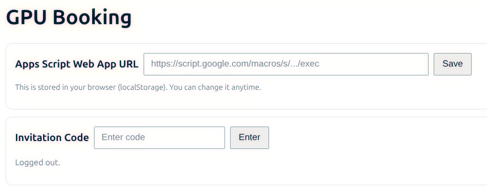
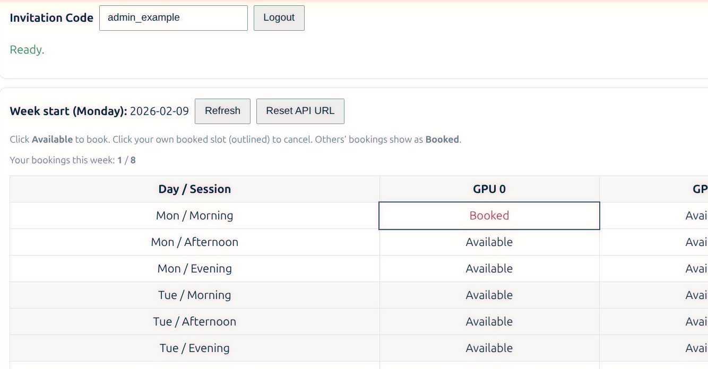

# Local Resource Booking System - Based on Google AppsScript

⚠️ Disclaimer: This project is a product of vibe coding and is for personal usage. No security checks have been implemented.

This repo contains a local resource booking system (such as a shared GPU cluster) that uses *Google AppsScript* as the backend, *Google Sheets* as the database, and *GitHub Page* as the frontend.
In this way, a locally private booking system can be freely secured and shared with non-admin users across different groups. (In the current example, it is assumed that four GPUs are available, and there are three slots every day.)

## Deployment
To deploy this simple system:
1. Create a **private** Google Sheets, with four sheets. Examples are available in [Sheets](/sheets_example). It is suggested to make sheets *Config*, *Code*, and *Logs* protected (right-click the tab and "Protect sheet").
2. From the menu, go to "Extensions → Apps Script". A new browser tab will pop up.
3. In the Apps Script page, create and copy all scripts from [AppsScript](appscript).
4. If you need automatical reset, run `installResetTrigger` once in `Reset.gs`. Deploy the project, and copy the Web app URL.
5. Deploy this GitHub repo to GitHub Page.

## Usage
Go to the page: https://githubusername.github.io/local_booking_system/. You will see a page:

Copy and paste the Web app URL from step 4 in the Deployment section (click "Save" to save the URL locally), and enter the invitation code from the Google Sheets (only the owner can edit and distribute the code). Then, you will see the booking page:

It is straightforward to use, so we won't go into details here. All the data and logs will be stored in the Google Sheets, and the admin can check and manage the booking system there.

